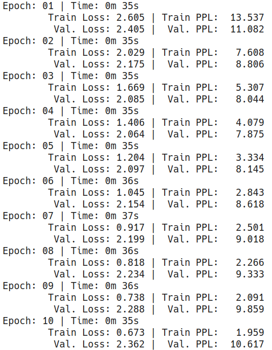
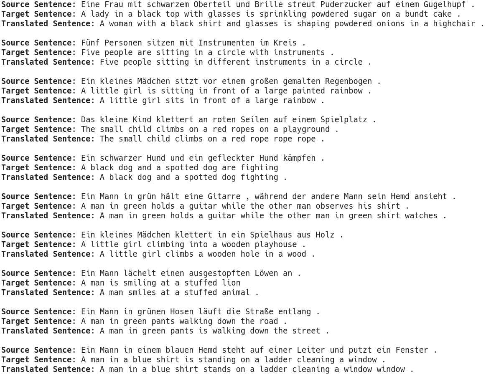

# E2A13

**Note: only code changes/major additional codes are shown. For complete code, please see the accompanying notebooks**

## Objectives
The objectives of this assignment was to implement Attention is all you need notebook without the legacy code.

### Link to Notebook

### Input Data
This notebook is designed to yield data in the form `[batch, seq_len]`. For this purpose, the `batch_first=True` argument was passed to `pad_sequence`

### Training Log

### Sample Predictions

### BLEU Score
The training yielded a BLEU score of 31.60.
